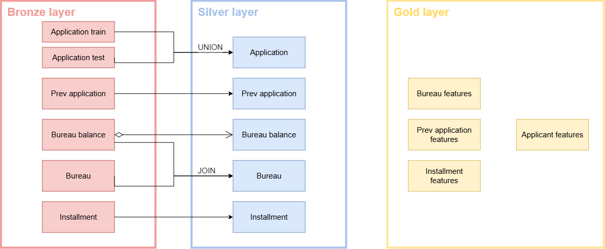

# dbt

## Visualization


## Project structure
```text
/dbt/
├── dbt_project.yml
├── profiles.yml
├── macros/
│   └── get_custom_schema.sql
└── models/
    ├── sources.yml
    ├── silver/
    │   ├── silver_application.sql
    │   ├── silver_bureau_balance.sql
    │   ├── silver_bureau.sql
    │   ├── silver_previous_application.sql
    │   └── silver_installments_payments.sql
    └── gold/
        ├── gold_bureau_features.sql
        ├── gold_previous_application_features.sql
        ├── gold_installments_features.sql
        └── gold_applicant_features.sql             ← final training/serving table
```

## List of features
